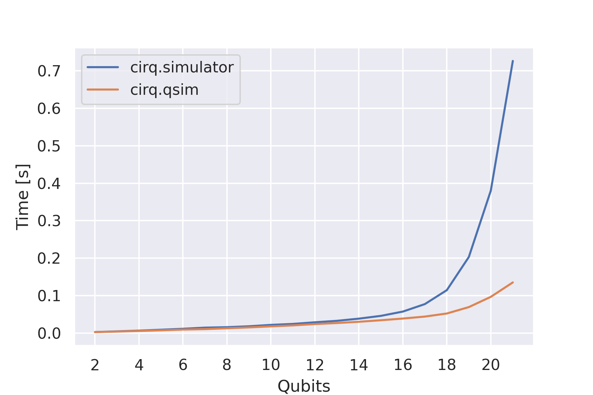

The qsim device
===============

qsim is a Schrödinger full state-vector simulator while qsimh is a hybrid
Schrödinger-Feynman simulator, cutting the qubit lattice into two parts and then
using qsim to simulate each part individually. For further details see the `qsim
website <https://github.com/quantumlib/qsim>`__. These simulators are
considerably faster compared to the Cirq simulator for many qubits, as can be
seen in the benchmark below.

You can instantiate the qsim device in
PennyLane as follows:

.. code-block:: python

    import pennylane as qml

    dev = qml.device('cirq.qsim', wires=2)

This device can then be used just like other devices for the definition and evaluation of QNodes within PennyLane.
A simple quantum function that returns the expectation value of a measurement and depends on three classical input
parameters would look like:

.. code-block:: python

    @qml.qnode(dev)
    def circuit(x, y, z):
        qml.RZ(z, wires=[0])
        qml.RY(y, wires=[0])
        qml.RX(x, wires=[0])
        qml.CNOT(wires=[0, 1])
        return qml.expval(qml.PauliZ(wires=1))

You can then execute the circuit like any other function to get the quantum mechanical expectation value.

.. code-block:: python

    circuit(0.2, 0.1, 0.3)

Device options
~~~~~~~~~~~~~~

qsim and qsimh use the same way of defining qubits as Cirq, e.g., ``LineQubit``
or ``GridQubit``. As with the Cirq device, the qsim and qsimh devices therefore
accept an additional argument ``qubits=None`` that can be used to define your
own qubits and give them to the device as a list.

.. code-block:: python

    import cirq

    qubits = [
      cirq.GridQubit(0, 0),
      cirq.GridQubit(0, 1),
      cirq.GridQubit(1, 0),
      cirq.GridQubit(1, 1),
    ]

    dev = qml.device("cirq.qsim", wires=4, qubits=qubits)

The wire of each qubit corresponds to its index in the ``qubit`` list. In the above example,
the wire 2 corresponds to ``cirq.GridQubit(1, 0)``.

If no qubits are given, the plugin will create an array of ``LineQubit`` instances.

qsimh options
^^^^^^^^^^^^^

qsimh requires specific options to be set for the simulator. These can be passed
by the positional argument ``qsimh_options``. See the `QSimh usage documentation
<https://github.com/quantumlib/qsim/blob/master/docs/usage.md>`__ for further
details.

.. code-block:: python

    import cirq

    qubits = [
      cirq.GridQubit(0, 0),
      cirq.GridQubit(0, 1),
      cirq.GridQubit(1, 0),
      cirq.GridQubit(1, 1),
    ]

    qsimh_options = {
        'k': [0],
        'w': 0,
        'p': 0,
        'r': 2
    }

    dev = qml.device("cirq.qsimh", wires=4, qsimh_options=qsimh_options, qubits=qubits)

Supported operations
~~~~~~~~~~~~~~~~~~~~

The ``cirq.qsim`` and ``cirq.qsimh`` devices support most PennyLane `operations
and observables
<https://pennylane.readthedocs.io/en/stable/introduction/operations.html>`_,
with the exceptions of inverse operations and ``QubitUnitary`` gates on 3 or
more qubits.

For state preparation qsim relies on decomposing ``BasisState`` into a a set of
`PauliX
<https://pennylane.readthedocs.io/en/stable/code/api/pennylane.PauliX.html>`__
gates and `QubitStateVector
<https://pennylane.readthedocs.io/en/stable/code/api/pennylane.QubitStateVector.html>`__
via `Möttönen state preparation
<https://pennylane.readthedocs.io/en/stable/code/api/pennylane.templates.state_preparations.MottonenStatePreparation.html>`__.
