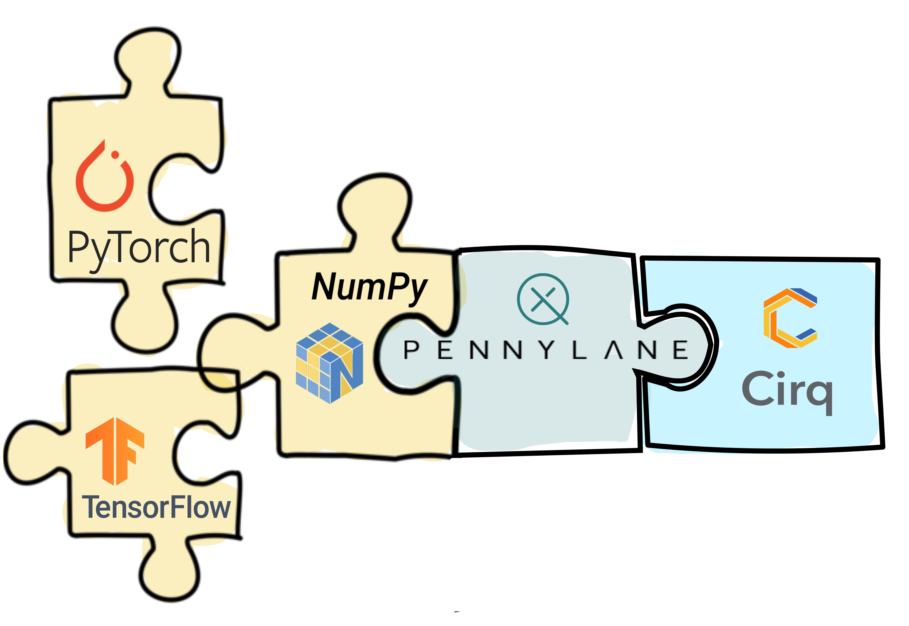

PennyLane-Cirq Plugin
#####################

:Release: |release|

|

.. include:: ../README.rst
  :start-after:	header-start-inclusion-marker-do-not-remove
  :end-before: header-end-inclusion-marker-do-not-remove

Once Pennylane-Cirq is installed, the provided Cirq devices can be accessed straight
away in PennyLane, without the need to import any additional packages.

Devices
~~~~~~~

Currently, PennyLane-Cirq provides one Cirq device for PennyLane:

.. devicegalleryitem::
    :name: 'cirq.simulator'
    :description: Cirq's simulator backend.
    :link: devices/simulator.html

.. raw:: html

        

         

.. toctree::
   :maxdepth: 2
   :titlesonly:
   :hidden:

   installation
   support

.. toctree::
   :maxdepth: 2
   :caption: Usage
   :hidden:

   devices/simulator

.. toctree::
   :maxdepth: 1
   :caption: API
   :hidden:

   code
